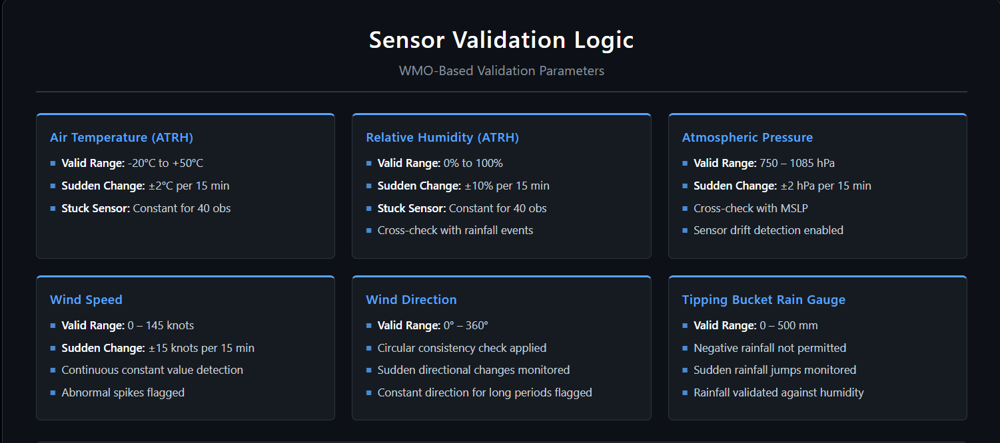
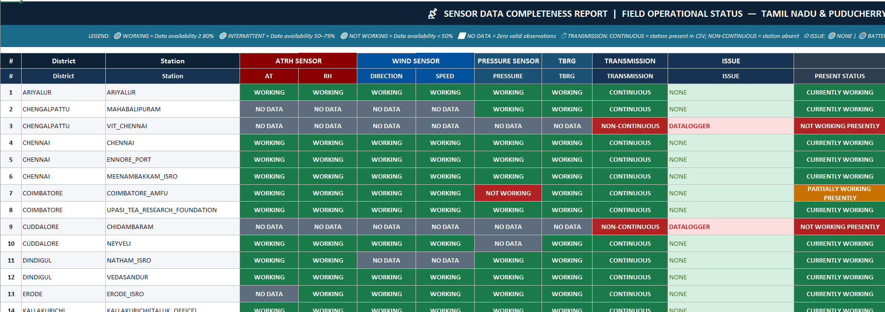
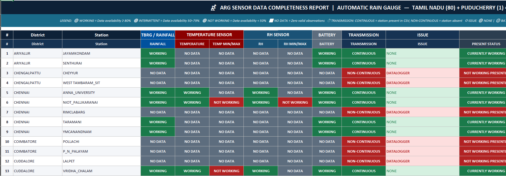
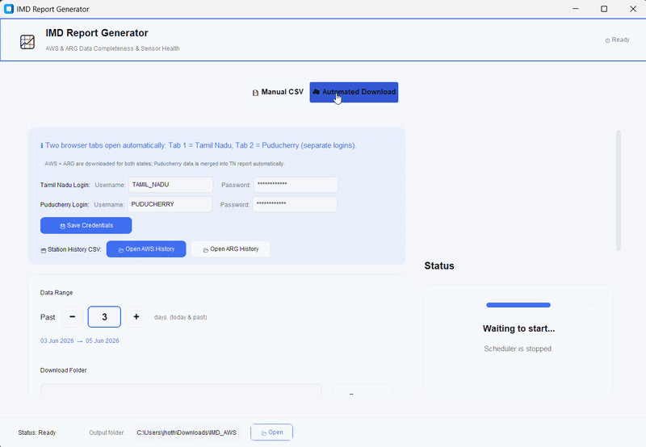
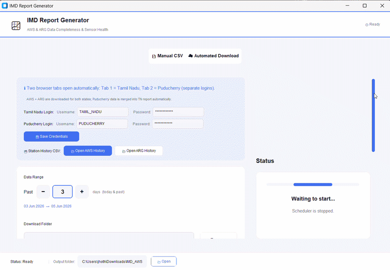

# IMD-Weather-Station-QC


An automated Quality Control and Health Monitoring System developed for Automatic Weather Station (AWS) and Automatic Rain Gauge (ARG) networks, providing real-time sensor health assessment, data completeness analysis, station history tracking, and operational report generation.

---

# 🌍 Project Overview

The **IMD AWS–ARG Quality Control & Health Monitoring System** is a Python-based desktop application developed for the **India Meteorological Department (IMD)** to automate the monitoring, validation, and reporting of meteorological observations collected from Automatic Weather Stations (AWS) and Automatic Rain Gauges (ARG).

The system eliminates the need for manual inspection of large volumes of station data by automatically downloading observations, performing WMO-compliant quality control checks, detecting faulty sensors, tracking station health, and generating detailed Excel-based health reports.

The application supports both **Tamil Nadu** and **Puducherry** meteorological networks and provides real-time monitoring through an integrated scheduler and automated browser workflow.

---


# 🌦️ Supported Sensors

<table>
<tr>
<td valign="top" width="50%">

### AWS Sensors

| Sensor | Parameter |
| :--- | :--- |
| ATRH Sensor | Air Temperature |
| ATRH Sensor | Relative Humidity |
| Aneroid Barometer | Station Level Pressure (SLP) |
| Ultrasonic Anemometer Sensor | Wind Speed |
| Ultrasonic Anemometer Sensor | Wind Direction |
| TBRG(Tipping Bucket Rain Gauge) | Rainfall |

</td>
<td valign="top" width="50%">

### ARG Sensors

| Sensor | Parameter |
| :--- | :--- |
| TBRG | Rainfall |
| ATRH | Temperature |
| ATRH | Relative Humidity |

</td>
</tr>
</table>


---

# 📏 WMO-Based Validation Checks

The application implements quality control procedures derived from the World Meteorological Organization (WMO) Guide to Instruments and Methods of Observation 


---

##  Cross-Sensor Validation

Checks physical consistency between multiple parameters.

Examples:

* Rainfall occurring with extremely low RH
* Wind direction fluctuations during calm winds
* SLP and MSLP consistency verification

---

# 📊 Generated Reports

## AWS Report

### AWS_QC_HEALTH_REPORT.xlsx


Contains:

* Data Completeness
* Sensor Details
* Cross-Sensor Validation
* WMO Proof of Standards

---

## ARG Report

### ARG_QC_REPORT.xlsx

Contains:

* Data Completeness
* Sensor Details

---

# 🖥️ Application Demonstration

<table>
<tr>
<td align="center" width="50%">




</td>

<td align="center" width="50%">




</td>
</tr>
</table>

# 📚 Technologies Used

* Python
* Pandas
* NumPy
* OpenPyXL
* Selenium
* Schedule
* CustomTkinter
* Tkinter

---

## ⚙️ Installation

**Python 3.10+ required**

```bash
git clone https://github.com/S-S-JHOTHEESHWAR/IMD-Weather-Station-QC.git
cd IMD-Weather-Station-QC
pip install -r requirements.txt
```

Then run:
```bash
python src/main.py
```


# 👨‍💻 Author

**S. S. Jhotheeshwar**

Electronics Engineering (VLSI Design & Technology)

Internship Project – India Meteorological Department (IMD)

---


If you find this project useful, please consider giving the repository a ⭐.


## Disclaimer

This project was developed during my internship at the India Meteorological Department (IMD) as part of the development of an automated Quality Control and Health Monitoring System for Automatic Weather Station (AWS) and Automatic Rain Gauge (ARG) networks.

The software is intended to support operational meteorological data monitoring by automating data validation, sensor health assessment, station history tracking, data completeness analysis, and report generation. The repository is shared to showcase the design, implementation, and software engineering practices involved in the development of the system.

No operational credentials, confidential information, restricted datasets, or sensitive internal resources are included in this repository. Any security-sensitive or organization-specific configurations have been removed prior to publication.

The source code, documentation, and related materials presented here reflect my individual contributions and experience gained during the internship. This repository is provided for professional, academic, and research reference purposes and should not be interpreted as an official software release, policy statement, or endorsement of the India Meteorological Department (IMD), the Ministry of Earth Sciences (MoES), or the Government of India.

