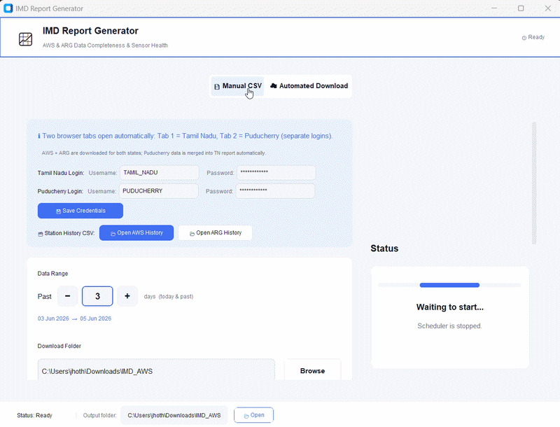

# IMD AWS–ARG Quality Control & Health Monitoring System

---
# IMD-Weather-Station-QC
An educational project demonstrating automated quality control, station health monitoring, data completeness analysis, and report generation for Automatic Weather Station (AWS) and Automatic Rain Gauge (ARG) networks.

---
# 🌍 Project Overview

The **IMD AWS–ARG Quality Control & Health Monitoring System** is a Python-based desktop application developed for the **India Meteorological Department (IMD)** to automate the monitoring, validation, and reporting of meteorological observations collected from Automatic Weather Stations (AWS) and Automatic Rain Gauges (ARG).

The system eliminates the need for manual inspection of large volumes of station data by automatically downloading observations, performing WMO-compliant quality control checks, detecting faulty sensors, tracking station health, and generating detailed Excel-based health reports.

The application supports both **Tamil Nadu** and **Puducherry** meteorological networks and provides real-time monitoring through an integrated scheduler and automated browser workflow.

---

# 🌦️ Supported Sensors

<table>
<tr>
<td valign="top" width="50%">

### AWS Sensors

| Sensor | Parameter |
| :--- | :--- |
| ATRH Sensor | Air Temperature |
| ATRH Sensor | Relative Humidity |
| Aneroid Barometer | Station Level Pressure (SLP) |
| Ultrasonic Anemometer Sensor | Wind Speed |
| Ultrasonic Anemometer Sensor | Wind Direction |
| TBRG(Tipping Bucket Rain Gauge) | Rainfall |

</td>
<td valign="top" width="50%">

### ARG Sensors

| Sensor | Parameter |
| :--- | :--- |
| TBRG | Rainfall |
| ATRH | Temperature |
| ATRH | Relative Humidity |

</td>
</tr>
</table>

---

# 📏 WMO-Based Validation Checks

The application implements quality control procedures derived from the World Meteorological Organization (WMO) Guide to Instruments and Methods of Observation 

---

##  Cross-Sensor Validation

Checks physical consistency between multiple parameters.

Examples:

* Rainfall occurring with extremely low RH
* Wind direction fluctuations during calm winds
* SLP and MSLP consistency verification

---

# 📊 Generated Reports

## AWS Report

### AWS_QC_HEALTH_REPORT.xlsx

Contains:

* Data Completeness
* Sensor Details
* Cross-Sensor Validation
* WMO Proof of Standards

---

## ARG Report

### ARG_QC_REPORT.xlsx

Contains:

* Data Completeness
* Sensor Details

---

# 🖥️ Application Demonstration

  

# 📚 Technologies Used

* Python
* Pandas
* NumPy
* OpenPyXL
* Selenium
* Schedule
* CustomTkinter
* Tkinter

---

# 👨‍💻 Author

**S. S. Jhotheeshwar**

Electronics Engineering (VLSI Design & Technology)

Internship Project – India Meteorological Department (IMD)

---

If you find this project useful, please consider giving the repository a ⭐.

## Disclaimer

This project was developed during my internship at the India Meteorological Department (IMD) as part of my learning and practical exposure to meteorological data processing, Automatic Weather Stations (AWS), and Automatic Rain Gauge (ARG) networks.

This repository is published solely for educational, academic, and software engineering demonstration purposes. It does not represent an official software product, recommendation, policy, or endorsement of the India Meteorological Department (IMD).

No operational credentials, confidential information, restricted datasets, or internal IMD resources are included in this repository. Any views, design decisions, implementations, and software components presented here are my own and are intended to showcase the knowledge, skills, and experience gained during the internship.

The content of this repository reflects my personal work and learning experience during the internship and should not be considered an official statement or position of the India Meteorological Department (IMD) or the Ministry of Earth Sciences, Government of India.

